---

# Relational Databases
<v-clicks>

- **Relational Model (Codd 19701)**: Decouples logical data representation from physical implementation, Isolates data from hardware and application logic (program).
- **Structured Query Language (SQL)**: High-level declarative language reflecting relational algebra for querying relational databases.
- **Relational Model Storage**: Data stored as tuples in structures called relations (tables) and you can querying it with SQL.
- **Relation Structure**:
  - **Header**: Finite set of attribute names (columns).
  - **Body**: Set of tuples (rows).

- **Abstract Access Layer**: Provides applications with a way to access, store, and modify data.
</v-clicks>
<Footnotes separator>
  <Footnote :number=1><a href="https://en.wikipedia.org/wiki/Relational_model" rel="noreferrer" target="_blank">Codd</a></Footnote>
</Footnotes>

---
layout: figure
figureCaption:  An example
figureUrl: ./rd-example.jpeg
---

#### Example Relation

Customer (*Customer_ID*, Tax_ID, Name, Address, City, State, Zip, Phone, Email, Sex).

---

# Relational Databases 
## Operations

There are various operations that can be done on a relation.

- Join
- Projection  (ℿ)
- Selection (σ)
-  set union, set difference, and exist ...

--- 

<v-click>

### Storing KGs 
</v-click>
<v-clicks depth="3">

- Large KGs may lead to large tables.
- Querying Challenge
  - Requires any type joins, potentially processing vast data.
    - A graph with 1M triples could involve 1012 rows in a naïve implementation.
</v-clicks>

 
<v-click>

### Domain and Range Definitions (RDF Schema)

</v-click>
<v-clicks>

- Domain: Specifies classes to which properties apply.

- Range: Defines the type of value a property can take.

- **Challenge**: Integrity constraints can partially enforce domain/range in a closed-world setting, but full RDFS semantics must be handled by applications.
</v-clicks>

---

### Class and Property Hierarchies

<v-clicks>

- Representation requires multiple auxiliary tables and joins.

- Application must hardwire semantics for hierarchies.

- Inheritance Issue: Property inheritance between subclasses (e.g., range inheritance) is complex and must be managed by the database designer.
</v-clicks>
<v-click>

### Impact on Declarative Nature 
</v-click>
<v-click>

- **Application logic must hardwire semantics of modeling languages (e.g., RDFS), reducing the declarative nature and reusability of knowledge graphs.**
</v-click>

---

### Statement table
<v-clicks>

- A simple way.

**How?**:

- RDF triples representing the knowledge graph can directly be stored in this table without any change

**Problems**

-  The data are not normalized. 

- A growing number of triples result in inefficient self-joins
</v-clicks>
---
layout: figure
figureCaption:  An example
figureUrl: ./Statement table.jpeg
---
---

### Class-centric table 

<v-clicks>

- Creates one table per class type to store all property values for that class.

- Properties may appear in multiple tables if shared across classes.
</v-clicks>
<v-click>

**Table Structure**:

</v-click>
<v-clicks>

- Each class in the knowledge graph is represented as a table.

- Properties of the class are represented as columns.

- Properties without value assertions in the knowledge graph may result in columns with NULL values, leading to sparse tables (many NULLs).

- For Queries use join with other classes(table). 
</v-clicks>

---
layout: figure
figureCaption:  An example
figureUrl: ./Class-centric.jpeg
---
---

#### Drawbacks
<v-clicks depth="2">

1. Adding new properties and classes is cumbersome as the schema must be recompiled.

2.  the level of normalization is not enough to handle multivalued properties as they lead to repetitions of tuples for each value of a property.
  
    - a hotel has multiple descriptions, we would need to create another tuple for the same hotel with a different description but repetitive values for all other columns.
</v-clicks>
---
layout: two-cols
---

### Property-centric

<v-clicks>

-  This approach use one table per property

- Each table contains two columns
  - subject
  - object
- This approach easily allows multivalued properties.
- But, duplication of subjects is still necessary.
</v-clicks>
::right::
 

<v-click>

 **Drawbacks**
 </v-click>
<v-clicks>

- Adding a new property requires the creation of a new table and, therefore, a recompilation of the schema.

- A common operation like retrieving properties defined on a single instance requires joins over a vast number of tables.
</v-clicks>
---
layout: figure
figureCaption:  An example
figureUrl: ./Property-centric.jpeg
---
---

---

### Virtual RDF graphs

<v-clicks>

- This approach have been a popular way to convert relational databases to KG in recent years.

- Do not store a concrete knowledge graph in a relational database.

- Provide an ontology-based access layer over existing relational databases.

</v-clicks>
<v-click>

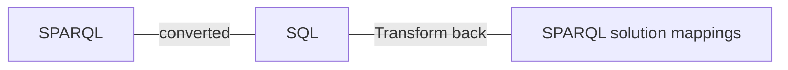

</v-click>
---

#### How works?
<v-switch>
<template #1>

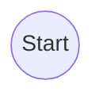
</template>
<template #2>
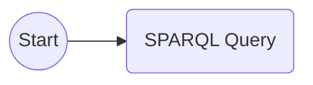
</template>
<template #3>
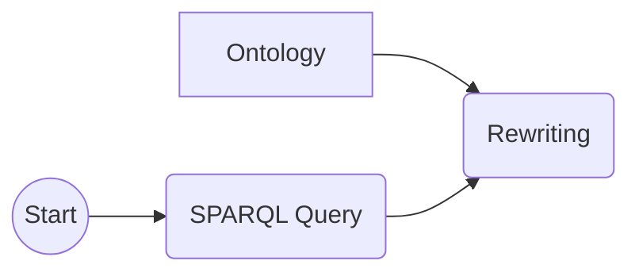

 The SPARQL query q is rewritten with respect to the ontology.
</template>
<template #4>
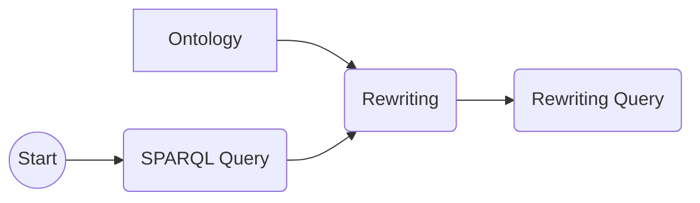
</template>
<template #5>
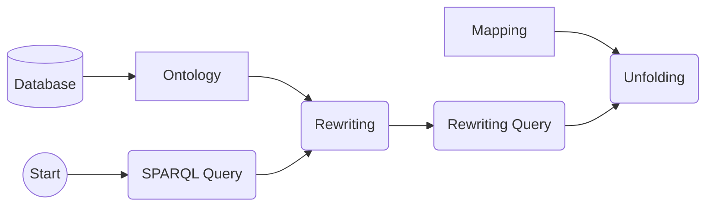
 The middleware unfolds the query q with respect to the mapping from the schema of
 the data source to the ontology.
</template>
<template #6>
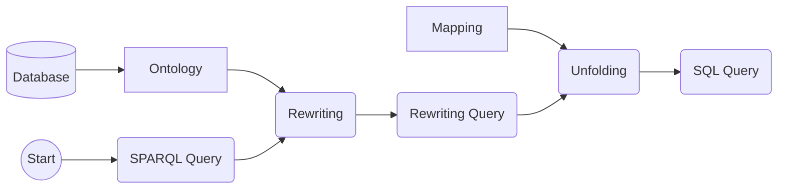

</template>
<template #7>
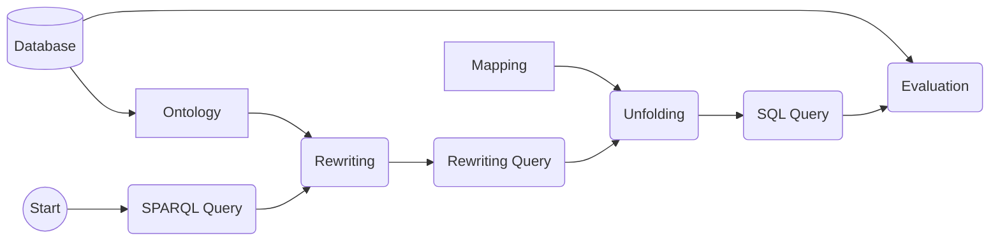
The generated SQL query is ready to be evaluated
 over the data source.
</template>
<template #8>
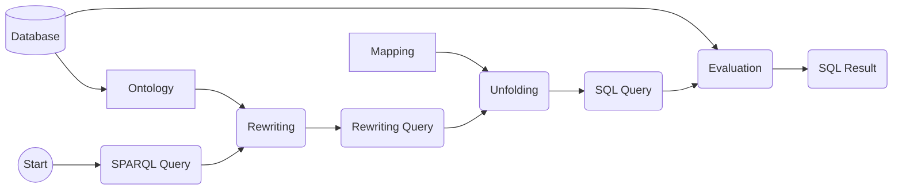
</template>
<template #9>
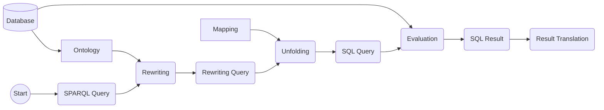
</template>
<template #10>
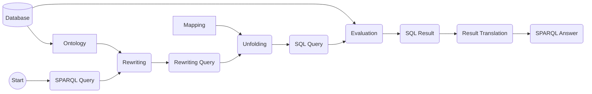
</template>
<template #11>

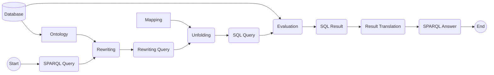

- Compiling the ontology into the mapping in an offline phase.

- Exploiting the constraints over the data to strongly simplify the queries after the unfolding phase.
- Planning query execution using a cost-based model.

-  A direct implementation of this workflow may be highly inefficient, some optimizations are required.

</template>
</v-switch>

---
layout: two-cols
---

#### Advantages and Drawbacks

<v-click>

##### Advantages
</v-click>

<v-clicks>

- They do not require any preprocessing on a RDBMS  .
- They allow ontology-based access via mappings and query rewriting.
  - SPARQL to SQL
- They provide a relatively cheap way to build a KG from relational databases.
- They provide a smooth integration in industrial standard software environments.
</v-clicks>

::right::

 
<v-click>

##### Drawbacks

</v-click>

<v-clicks>

- Many things can go wrong with query rewriting and unfolding.
  - mappings need extra attention
- Querying the schema is challenging.
  - Due to the underlying relational model.
- Typically, only limited querying and reasoning capabilities are provided.
</v-clicks>
---
hide: true
---

# Relational Databases

[comment]: <> (من اینو بهتره خلاصه ترش بکنم. به این شکل که یه بخشی اش بره داخل اسلاید های اضافی)

- **Relational Model (Codd 19701)**: Decouples logical data representation from physical implementation.

- **Structured Query Language (SQL)**: High-level declarative language reflecting relational algebra for querying relational databases.

- **Separation**: Isolates data from hardware and application logic (program).

- **Data Storage**: Stored in relations (tables).

- **Operations**: Performed at the relational level, allowing simultaneous operations on multiple tuples.

- **Relational Algebra**: Formalizes operations using set-based operations.

- **Abstract Access Layer**: Provides applications with a way to access, store, and modify data.
<Footnotes separator>
  <Footnote :number=1><a href="https://en.wikipedia.org/wiki/Relational_model" rel="noreferrer" target="_blank">Codd</a></Footnote>
</Footnotes>

---

#### An Implementation

<v-clicks>

- **Ontop** 
    
- Virtual RDF graph framework (Xiao et al. 2020).
- Distributed under the Apache 2.0 license.
- Supports customized mapping language and R2RML (RDB to RDF Mapping Language).
- Handles a subset of SPARQL 1.1 with optimizations for Join, Union, and LeftJoin operations.
- Implements reasoning through query rewriting, supporting the OWL 2 QL profile.
</v-clicks>

---

## Summarize

<v-clicks>

- **Data Model**: Relational model struggles with flexible schemas of knowledge graphs, where data and schema boundaries blur, unlike rigid, decoupled schemas in relational databases.

- **Heterogeneity**: Representing graph models requires numerous queries and costly joins, making it inefficient.

- **Velocity**: Inference generating new TBox knowledge may necessitate schema recompilation, an expensive operation.

- **Relationship Representation**: Modeling relationships like inheritance is complex.

- **Entailment Rules**: Implementing RDFS entailment rules is not straightforward and often requires application logic or external rules.

</v-clicks>